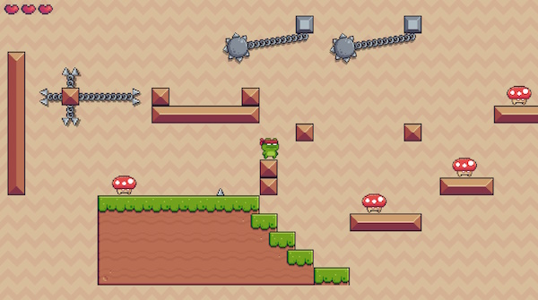
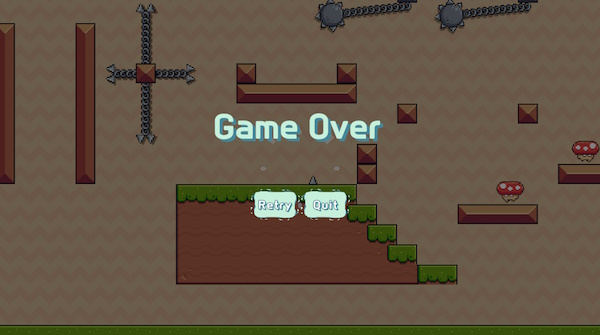

# Crazy Dungeon (크레이지 던전)

Crazy Dungeon is a simple 2D platformer game that I'm currently developing to learn Unity and build my portfolio. It's still in the very early stages, but I plan to add a variety of enemies, hazards, and platform types.

크레이지 던전은 간단한 2D 플랫포머 게임의 프로토타입이며, 유니티를 배우고 포트폴리오를 구축하기 위해서 개발하고 있습니다. 아직은 완전 초기 단계지만 다양한 적, 장애물, 플랫폼 유형을 추가할 예정입니다.

- Recommended Unity version: Unity 6 (6000.0.26f1 and later)

## Authors

- [@trymorez](https://www.github.com/trymorez) (trymorez@gmail.com)

## Screenshots

## Used Assets

**2D Sprites**
- Pixel Adventure 1 (https://pixelfrog-assets.itch.io/pixel-adventure-1)
- Pixel Adventure 2 (https://pixelfrog-assets.itch.io/pixel-adventure-2)
- Kings and Pigs (https://pixelfrog-assets.itch.io/kings-and-pigs)
- Tiny Swords (https://pixelfrog-assets.itch.io/tiny-swords)

## Version History

- Enemy movement routine revised

**v 0.15 (2024-12-31)**
* Player character dead animation added
* Game over screen now works properly
* Added 1st basic enemy type (mushroom)

**v 0.1 - (2024-12-30)**
- Initial version
