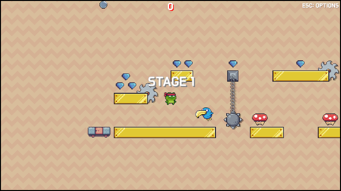
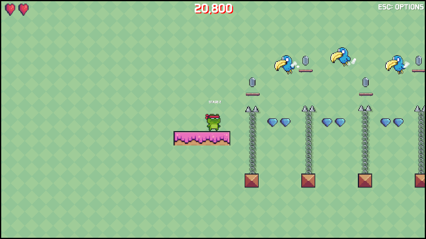

# Crazy Dungeon

[**[Play Game!]**](https://trymorez.github.io/unity-2d-platformer/Build/index.html)

Crazy Dungeon is a simple 2D platformer game that I'm currently developing to learn Unity and build my portfolio. It's still in the very early stages, but I plan to add a variety of enemies, hazards, and platform types.

- Recommended Unity version: Unity 6 (6000.0.32f1 and later)

## Screenshots

## Used Assets

**2D Sprites**
- Pixel Adventure 1 (https://pixelfrog-assets.itch.io/pixel-adventure-1)
- Pixel Adventure 2 (https://pixelfrog-assets.itch.io/pixel-adventure-2)
- Kings and Pigs (https://pixelfrog-assets.itch.io/kings-and-pigs)
- Tiny Swords (https://pixelfrog-assets.itch.io/tiny-swords)

## Version History
**v 0.3 (2025-01-28)**
- Fixed several bugs for WebGL build

**v 0.27 (2025-01-09)**
- A new enemy type (bluebird) has been added
- Added new effect for player jump attack

**v 0.26 (2025-01-08)**
- Options dialog box has been added (Press ESC to open Options dialog box)
- Sound and music volume slider has been moved to the options dialog box
- The game over dialog box has been redesigned
- The player can't take damage while dead

**v 0.252 (2025-01-07)**
- Provided default values for sound and music volume in case there are no PlayerPrefs yet

**v 0.25 (2025-01-07)**
- BGM added
- BGM volume slider
- Refactored sound and BGM manager so it doesn't require reference to volume sliders

**v 0.24 (2025-01-06)**
- Refactored moving platform class to share parent class with rotating saw
- Rotating saw added
- Level transition effect added
- Player appearing effect added

**v 0.22 (2025-01-05)**
- Moving platform added
- Falling platform added
- Score popup's sorting layer increased
- Stage 2 Edited

**v 0.19 (2025-01-04)**
- Added instant death zone (level pit)
- Added rotating spike ball
- Score animation improved
- Gem item added
- Fixed jumping anomaly at platform edges
- Stage 1 Edited

**v 0.18 (2025-01-03)**
- Score system added
- Score animation added(when you kill enemy)
- Door animation added

**v 0.17 (2025-01-03)**
- Level progress mechanism(door) added.
- Level(dummy) 2, 3 added.

**v 0.16 (2025-01-02)**
- Player attack (step on) sound added
- Prevents players and enemies from colliding again for a certain amount of time after colliding
- Button animation in game over screen restored
- Changed colliders of player characters and enemy characters to capsule colliders to improve collision accuracy
- Added text to show the level when starting a level

**v 0.153 (2025-01-01)**
- Sound volume is saved between sessions

**v 0.152 (2025-01-01)**
- Player short jump restored
- Provides a little jump when the player character steps on an enemy
- Implemented sound library and sound manager
- Added basic jump sound effect
- Enemy movement routine revised

**v 0.15 (2024-12-31)**
* Player character dead animation added
* Game over screen now works properly
* Added 1st basic enemy type (mushroom)

**v 0.1 - (2024-12-30)**
- Initial version
